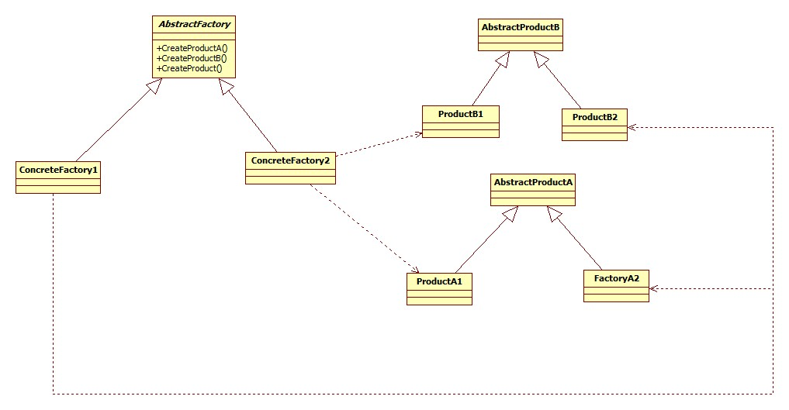

# 问题：

1. 画出通用类图（20分，并说明各个类的作用）
2. 实战例子.提出两个抽象工厂的例子，实现它，并说明其中各个类扮演的角色。。(20分)
3. 有什么优点和缺点。（4项，20分）
4. 适用性和意图（5点，20分)

# 答案
1. 实战例子.提出两个抽象工厂的例子，并实现它。

   - 同样的前端，不同的后台数据库实现。可参考代码。

     [MazeFactory.py](MazeFactory.py)
     
- 设计模式书籍里的迷宫，具体实现可参考代码 [EMployeeDao.py](EMployeeDao.py)
   
2. 画出通用类图。

    - AbstractFactory:
      - 声明一个创建抽象产品对象的操作接口。
    - ConcreteFactory:
      - 实现创建具体产品对象的操作。
    - AbstractFactory:
      - 为一类产品对象声明一个接口。
    - ConcreteProduct:
      - 定义一个将被相应的具体工厂创建的产品对象。
      - 实现AbstractProduct的接口。
    - Client：
      - 仅使用由AbstractFactory和AbstractProduct类声明的接口。

3. 适用性和意图：
    意图：提供一个创建一系列相关或相互依赖对象的接口，而无需指定它们具体的类。

