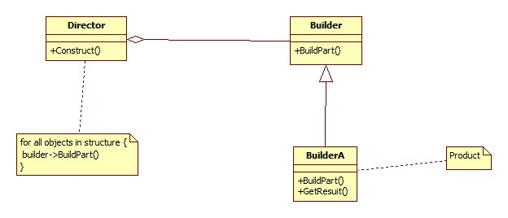

# 感受：

1. 定义一个流水化的组装过程，流水线上的每个部件都可以自定义，通过更换不同的部件，可以产生出各种不同型号的机器来。

# 问题：

1. 画出通用类图（20分，并说明各个类的作用）
2. 实战例子.提出两个生成器的例子，实现它，并说明其中各个类扮演的角色。。(20分)
3. 有什么优点和缺点。（4项，20分）
4. 适用性和意图（5点，20分)

# 答案：
1. 通用类图。

   

   其中各个类的作用：

   - Director的类作用是产生产品对象。通过Construct的方法按一定次序构造出产品。
   - Builder定义产品构建过程中需要的各个部件构造过程。最后通过GetResult方法返回构建好的产品。为创建一个Product对象的<u>各个部件指定抽象接口</u>。
   - Product 表示被构造的复杂对象。
     - Builde和其子类定义了创建该产品的内部表示并定义了它的装配过程。
     - 包含定义组成部件的类，包括将这些部件装配成最终产品的接口。

   文档转换器的例子，迷宫的计数器。

   